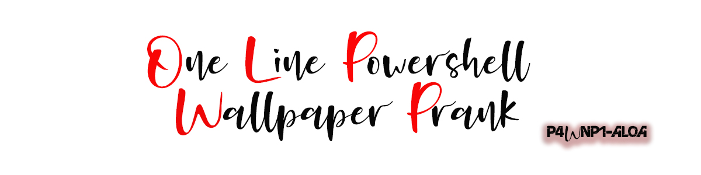
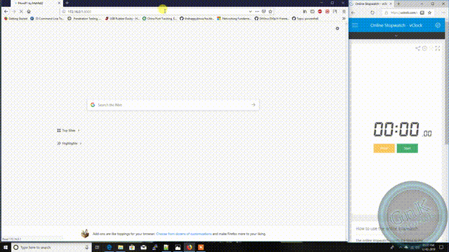

# One Line Powershell Wallpaper Changer

## Description
Single stage powershell one-liner executes from run dialog. CMD opens a hide powershell window which downloads b.jpg (change this URL) to C:\Users\Username then sets the registry entry to change the wallpaper, then finally loops over an undocumented USER32.DLL feature for 60 seconds to force a user profile ref

## Demo

