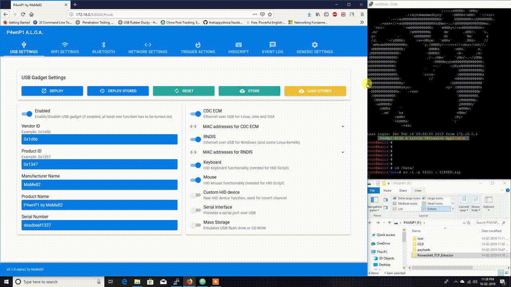

# Powershell TCP extractor

## Description

Copies data to temp directory and uses powershell tcp socket to extract to a listener on remote machine

## Output

nc -l -p 54321 > ZIPPED.zip

## demo

