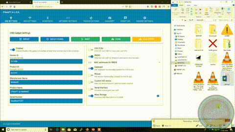

# SmartFileExtract Exfiltrator
SmartFileExtract is a find-and-copy utility written specifically for the Hak5 BashBunny but also is usable as a standalone utility. Files are found by standard patterns (including wildcards) and then copied to any valid path.

- Finds all files with a) the word secret or pass in the filename as well as b) any DOCX files
- Reports status as a fake install window
- Stops extract after 90 seconds or 500 MBs

Setup:
- Download the SmartFileExtract utility from https://github.com/saintcrossbow/SmartFileExtract
* Quick tip: you only need the SmartFileExtract.exe from the project copy to "P4WNP1" SmartFile\

## File Extensions

     1 *.DOC and .DOCX    Microsoft Word documents. 
     2 *.PDF              PDF files
     3 *.XLS and .XLSX    Microsoft Excel
     4 *.PPT and .PPTX    Microsoft PowerPoint

